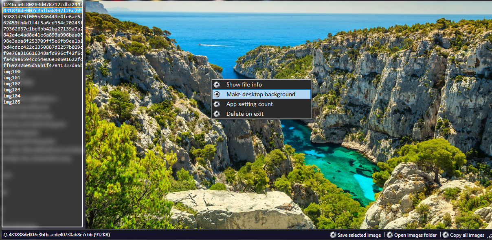

# Lock Screen Images Viewer

> This is a reworked version of the [keenthinker](https://github.com/keenthinker/WindowsLockScreenImages) version.

**Dependencies**

| Assembly | Version |
| ---- | ---- |
| NET Core | 6.0 |

### 📝 v2.0.0.0 - January 2025

* Reworked/Enhanced the original version to be bug free and have new features.
    - Added acrylic/glass support via [DWM](https://learn.microsoft.com/en-us/windows/win32/dwm/dwm-overview)
    - Added custom dialogs and context menus (the default `MessageBox` had to go)
    - Added new features and dark mode theme
    - Added helper extensions for routines
    - Added customer renderer for the ToolStrip
    - Fixed minor bugs/annoyances

## Overview

The Windows Lock Screen Images Viewer is a simple application that allows you to easily view and navigate to the directory containing the Windows lock screen images. It provides a user-friendly interface to explore the images and save them in a custom directory.

## Features

- **Image preview:** View an image by clicking on a list item or using the up/down arrows on your keyboard.
  
- **Open directory:** Quickly navigate to the directory where Windows stores the lock screen images.

- **Copy images:** A simple way to make a backup of all the images to the locale app folder. This will append the appropriate extension after completion.

- **Remove on exit:** Mark images you don't like to be removed once the application closes.

## System Requirements

- Windows 10 / 11 (various versions)

## 🧾 License/Warranty
* Permission is hereby granted, free of charge, to any person obtaining a copy of this software and associated documentation files (the "Software"), to deal in the Software without restriction, including without limitation the rights to use, copy, modify, merge, publish and distribute copies of the Software, and to permit persons to whom the Software is furnished to do so, subject to the following conditions: The above copyright notice and this permission notice shall be included in all copies or substantial portions of the Software.
* The software is provided "as is", without warranty of any kind, express or implied, including but not limited to the warranties of merchantability, fitness for a particular purpose and noninfringement. In no event shall the author or copyright holder be liable for any claim, damages or other liability, whether in an action of contract, tort or otherwise, arising from, out of or in connection with the software or the use or other dealings in the software.
* Copyright © 2024. All rights reserved.

## 📋 Proofing
* This application was compiled and tested using *VisualStudio* 2022 on *Windows 10* versions **22H2**, **21H2** and **21H1** and *Windows 11* versions **24H2**, **23H2**.

